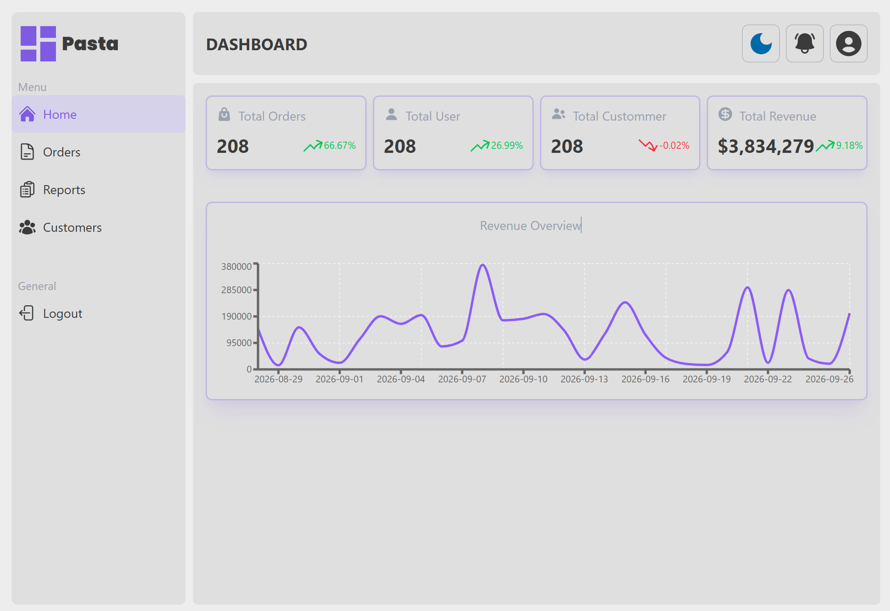
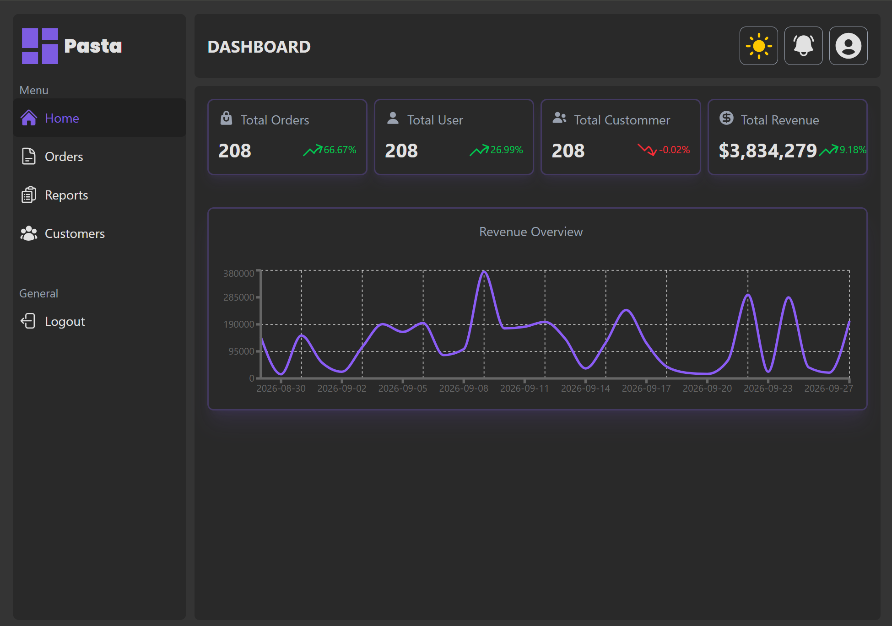

# Pasta Dashboard

An admin dashboard for an online shop, built with Next.js, TypeScript and Tailwind CSS.
It uses the dummyJSON API as a mock backend.

🔗 **Live demo:** https://dashboard.gholamidev.ir/login


## Pasta dashboard home page





## Features

- Login and logout with a server-side auth proxy
- Secure auth: tokens are stored in httpOnly cookies, not in localStorage
- Route protection with Next.js proxy (middleware): users who are not logged in cannot open the dashboard pages
- Stat cards: Orders, Users, Customers, Revenue (with trends)
- Revenue chart built with Recharts
- Data fetching and caching with TanStack Query
- Sidebar navigation and responsive layout

## Tech Stack

- Next.js (App Router)
- React
- TypeScript
- Tailwind CSS
- TanStack Query
- Recharts
- Deployed on Vercel

## Getting Started

```bash
git clone https://github.com/BhGh1081/OnlineShop-Dashboard.git
cd OnlineShop-Dashboard
pnpm install --frozen-lockfile
pnpm dev
```

Open http://localhost:3000

## Demo Account

- Username: `emilys`
- Password: `emilyspass`

## Project Structure

```
app/         # pages, layouts, route handlers
components/  # shared UI components
context/     # React context (UserContext)
hooks/       # custom hooks
lib/         # pure helper functions
services/    # all network calls, split by entity
types/       # TypeScript types
```

## Architecture Decisions

- **Services layer:** all fetch calls live in `services/`. Components stay clean.
- **Fetch once, pass down:** the page fetches carts one time and passes data to the cards and the chart.
- **Pure functions:** calculations like `getCartsSummary` do not fetch. They are easy to test.
- **Simulated dates:** dummyJSON has no dates, so I create stable dates from the item id.
- **Route protection with Next.js proxy:** The access token is stored in an httpOnly cookie, so JavaScript in the browser cannot read it. The proxy checks this cookie before a page loads. If it is missing, the user goes to the login page.
- **User state with React Context + TanStack Query:** The current user is shared in the whole app with a Context provider. The data is cached with TanStack Query, so login and logout update the UI right away.

## Roadmap

- [ ] Orders page with pagination
- [ ] Customers page